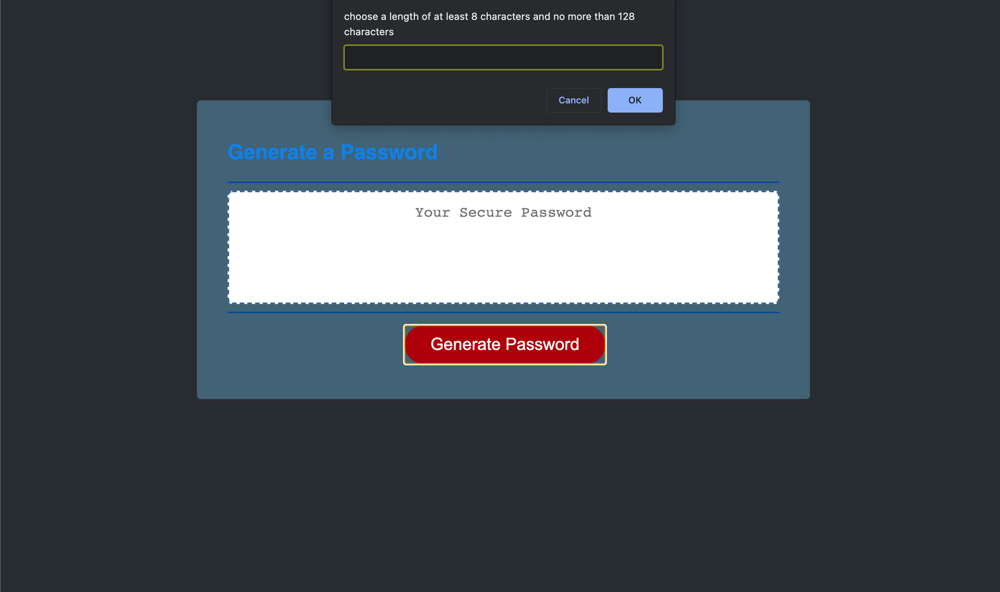

# Password Generator 	

## Description

Made this project with Javascrip, using a loops booleans and 
arrays to enable the user to  generate a random secured password based on users criteria.

App: https://mf948.github.io/Password-generator-app/

 Github: https://github.com/Mf948/Password-generator-app

## Table of contents

[User Story ](#user)  
[Installation](#installation) 
[Technology used](#technology) 
[Deploying the App](#Deploying)
[License](#License)  

## User Story
generate a propmt that asks the following:length of at least 8 characters and no more than 128 characters, include following caracyer prompts; choose lowercase, uppercase, numeric, and/or special.

## technology used:
This app uses the following technologies : HTML, CSS, and Javascript.
## Installation
no prior Intstallation required

## Deploying 
 not need to deploy app, use the link to run or git clone and happy coding

## License
Apache License 2.0